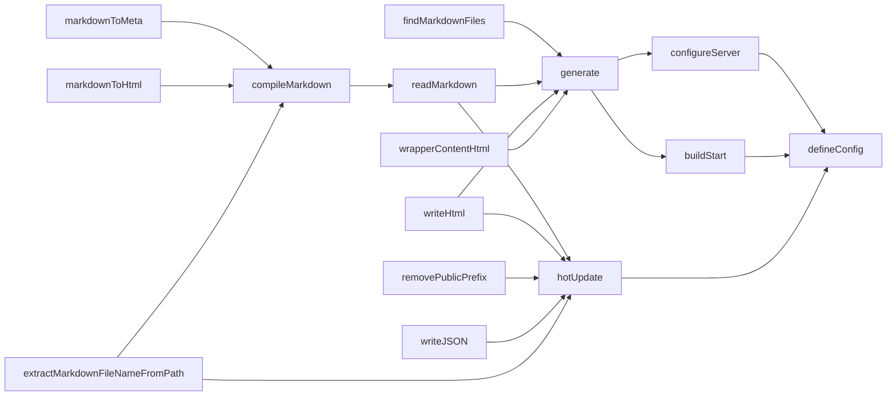
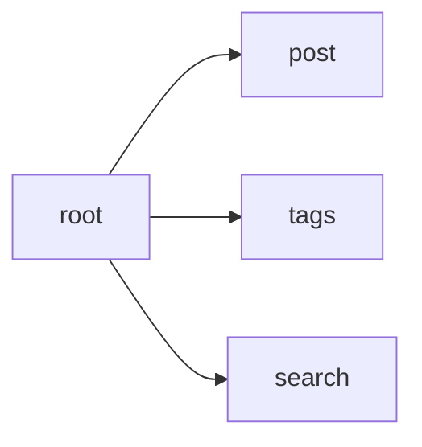

# new blog 2025

- 프레임워크 없이 개발자 블로그를 다시 만드는 도전입니다.

## 설치

```sh
git clone https://github.com/arch-spatula/new-blog-2025.git
```

```sh
pnpm install
```

## 실행

```sh
pnpm run dev
```

```sh
pnpm run build
```

```sh
pnpm run preview
```

## 프로젝트 계기

- html first를 추구하고 싶여졌음.
  - htmx랑 관련 없음.
  - 최대한 html과 원레 브라우저와 웹 기능을 활용하려는 것이 의도.
  - SPA 방식으로 처리하는게 더 단순하면 SPA 방식을 선택함.
  - MPA가 오히려 단순한 경우가 더 많아 MPA 방식들을 사용함.
- 현대시대 대부분의 사용자들이 사용하는 컴퓨터 수준에서 굳이 SPA를 강하게 고수해야 할 이유가 없음.
  - SPA의 복잡성을 제거하고 그냥 다시 받아 다시 랜더링하게 만들어서 개발을 단순하게 만들고자 함.
  - HTML이 밥과 같다면 JavaScript는 MSG처럼 소량만 넣어야 하는데 과도함.
  - 굳이 Github Pages에 올리는데 파일서빙 비용을 아껴주고 싶지 않음.
  - 머나먼 미래에 Github Pages가 사라져도 결국 html 리소스 링크를 중심으로 활용해서 운용이 가능했으면 함.
- vite를 SPA 빌드를 위해 사용하지 않고 그냥 빌드를 위해 사용함.
- 다른 SSG 프레임워크를 사용하다가 어느날 갑자기 빌드를 깨먹고 하위호환성을 보장 안해주는 것에 질려서 이 프로젝트를 시작함
  - 빌드를 깨먹어도 스스로 깨먹을 것.
- 굳이 원하는 것도 아닌 커스텀 기능에 이상한 방식으로 마크다운 작성하는 장단을 맞추기 싫었음.
- 스스로 원하는 기능은 스스로 추가하고자 함.
  - 직업이 프론트엔드 개발자인데 이것도 못하면 자존심 상함.
- 인생이 대략 4000주이고 보통 가치있는 글은 2주 정말 간결하면서 가치있으면 1주일인데 4000개의 큼직한 객체배열과 브라우저 DOM 요소가 클라이언트 컴퓨터 골로 보내는 것음 못 봄.
  - ~~코드 존나 깔끔하게 짰어 이러니까 브라우저들이 뻑가지~~
  - 1년 52주이면 이미 1000주는 못 씀
    - 150살 정도면 6000주 넘길 수 있을 것 같은데 정신은 말짱할지 모르겠음.
    - 은퇴한 뒤에도 개발자 블로그를 작성하는 것이 목표는 맞음.
- 여러분의 30ms보다 저의 3개월이 더 소중합니다.
- MPA는 납득할 수 있는데 그럼 astro는 왜 사용 안 하는가?
  - 잘 신뢰가 가지 않음.
  - 좋은 기술은 맞지만 아직도 미숙한 단계라고 봄.
  - 회사에서 CMS 사이트를 하나 만들라고 하면 후보군 중 하나로 이야기 해볼 것 같음.
- CSS에 대해서...
  - ~~자세한 설명은 생략한다.~~
  - 파일 1개에 다 때려 넣는다. 파일 2개 이상 필요하면 쓸 때 없이 복잡하게 짠 것이다.
  - 이전 블로그 개발할 때 활용한 github 태마를 이어서 사용함.
- SEO에 대해서...
  - 현재 SEO에 대한 계획은 전혀 없음.
    - 나중에 SEO를 고려해서 빌드 시점에 HTML을 수정할 계획이 있음.
    - 동적으로 DOM 조작하는 것도 클래스 이름 추가하고 삭제하는 방식으로 처리하고자 함.
  - 네임드 개발자도 아닌데 SEO가 필요한가?
  - 지금 DOM을 동적으로 조작하는 부분들은 SPA랑 비슷해서 bot이 감지하고 활용하는데 불리한 부분이 많음.

## 아키텍쳐

- MPA로 여러 html을 public에 만들어서 제공함.

### 빌드



### 사이트맵


